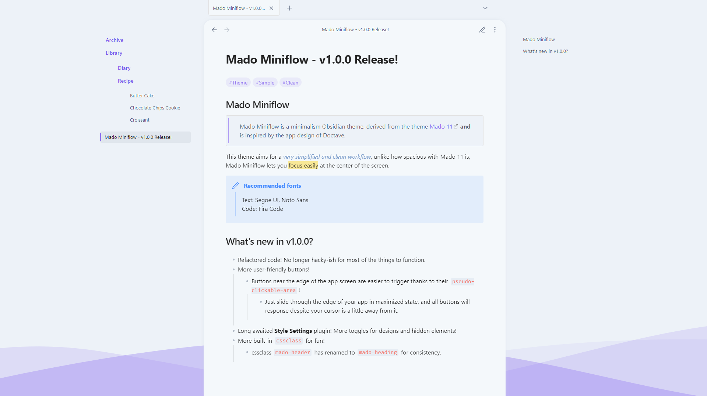
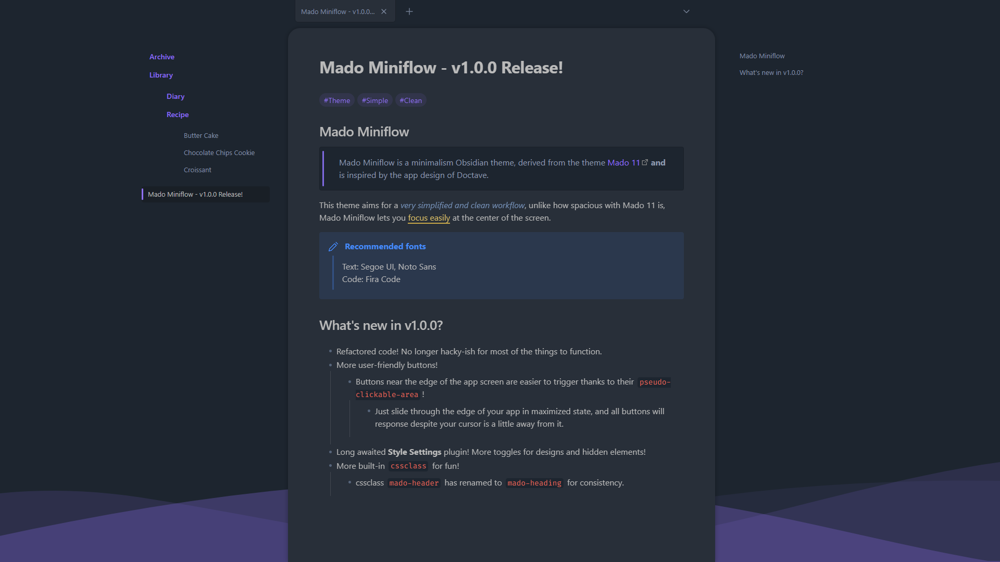
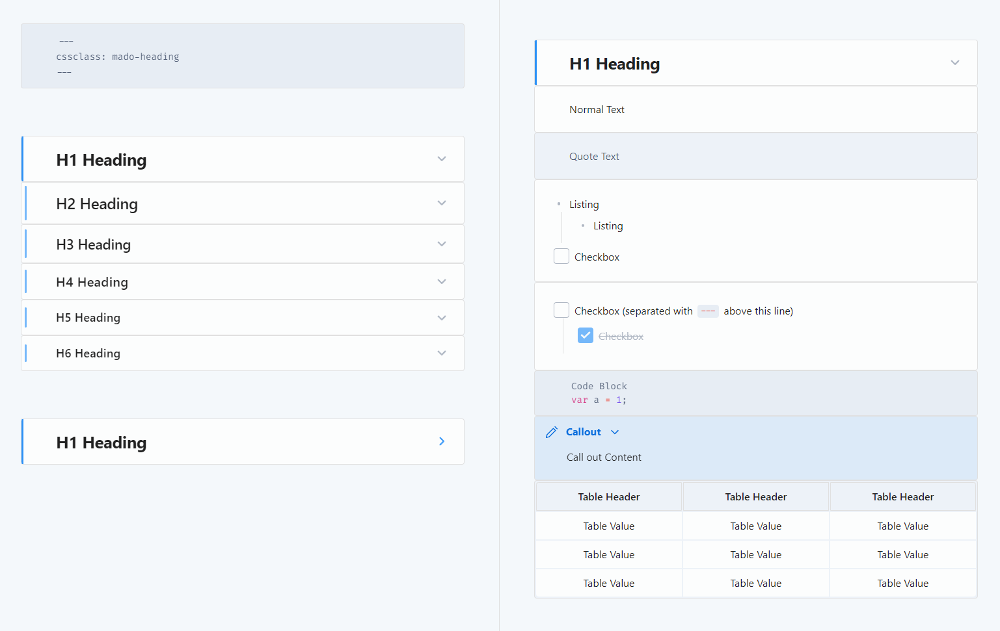
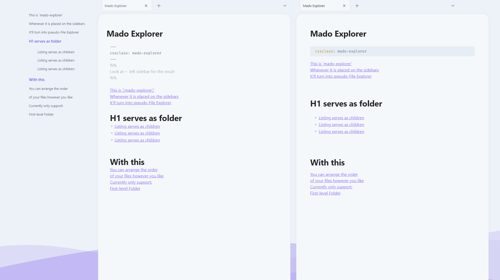
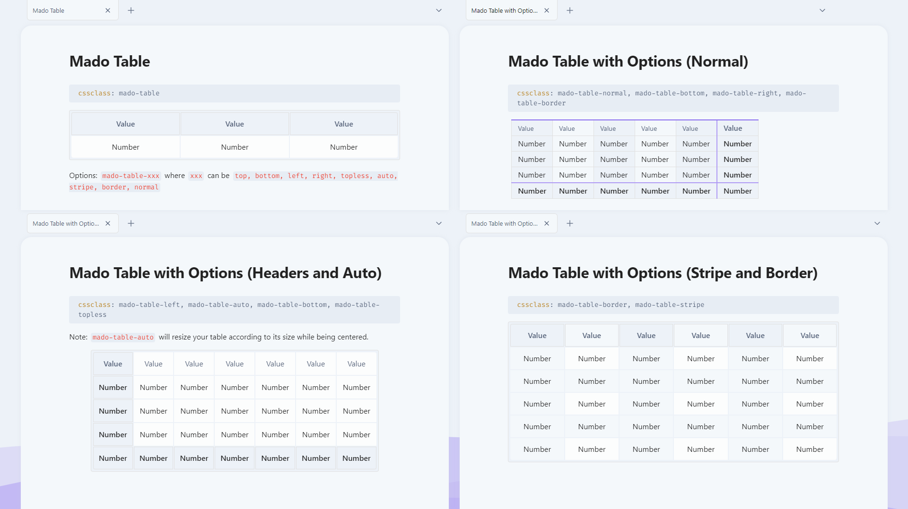
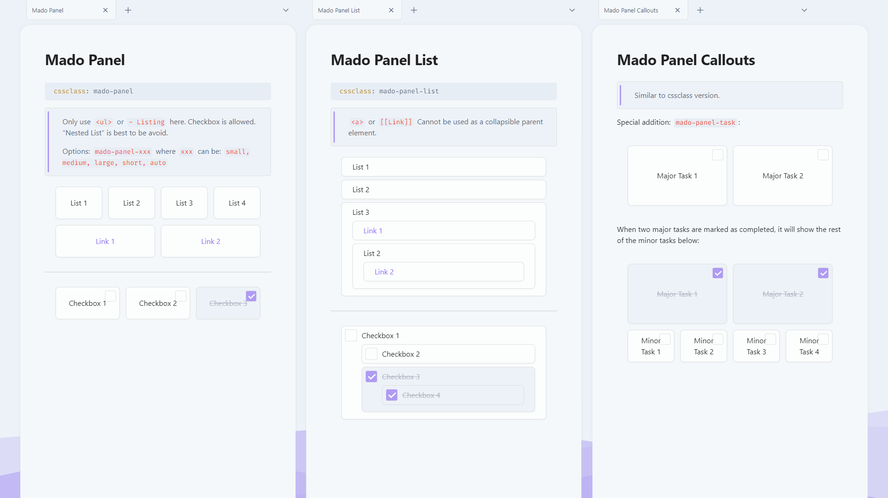
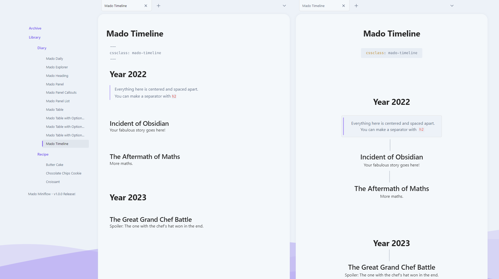
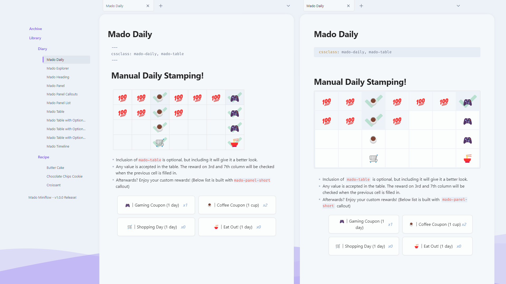
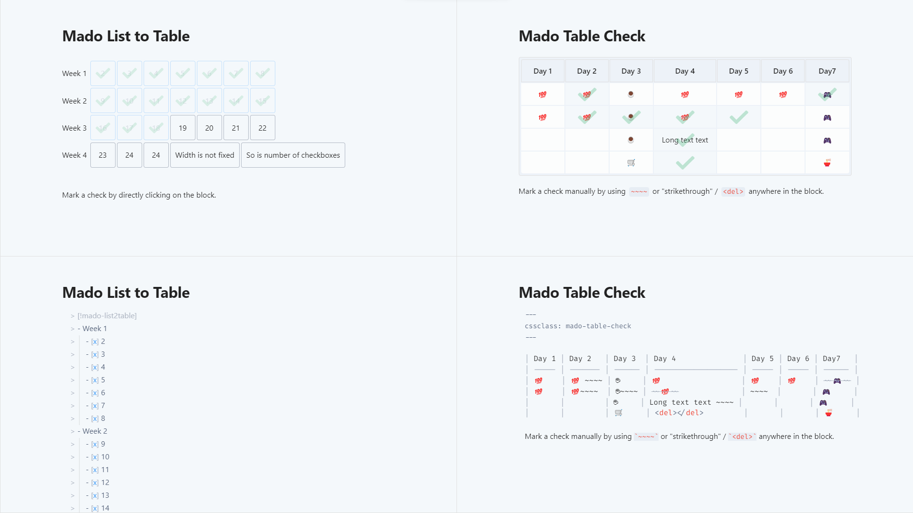

# Obsidian Theme - Mado Miniflow
Mado Miniflow is a minimalism Obsidian theme, derived from the theme [Mado-11](https://github.com/hydescarf/Obsidian-Theme-Mado-11) and is inspired by the app design of [Doctave](https://www.doctave.com/).
The wave design in the background is made with https://www.shapedivider.app/

This theme aims for a very simplified and clean workflow, unlike how spacious with Mado 11 is, Mado Miniflow lets you focus easily at the center of the screen.




Recommended fonts for this theme:
- Text: Segoe UI, Noto Sans
- Code: Fira Code

## Mado CSS Classes For Fun!
<details>
<summary><b>Mado-Heading</b></summary>



```
cssclass: mado-heading
```
Transforming your normal note into more bulky block button design!

</details>
<details>
<summary><b>Mado-Explorer</b></summary>



```
cssclass: mado-explorer
```

When placed onto the sidebar, it will become exactly like how File Explorer would look like. A.k.a. pseudo-File Explorer!
There are rules for this to work:

```
1. You may only use <a>(link), <h1>(h1 heading) and <li>(list) in the note.
2. <a> will act as first level file title.
3. <h1> will act as first level folder title.
4. <li> will act as first level folder's children, where its contents should fill with just <a>, and itself should be placed below <h1>.
5. Second level folder, or nested <li>, is not possible.
6. For <h1> to be foldable, you have to enable the foldable option in the settings.

```

Example:

```
[[File 1]]
[[File 2]]
# Folder 1
- [[Listed File 1]]
- [[Listed File 2]]
[[File 3]]
```

</details>
<details>
<summary><b>Mado-Table</b></summary>



```
cssclass: mado-table
```

Turns your normal-looking table into a fancy spacious one! With more options provided for you to tweak the like of it.
Example:

```
cssclass: mado-table (special styling)
cssclass: mado-table-XXX (special styling with XXX being the options)
cssclass: mado-table-XXX, mado-table-XXX (special styling with multiple options)
```

```
Options:
mado-table-auto (auto-widen table size by its contents and center it)
mado-table-normal (no special styling, include this if you wish to use other options without special styling)

mado-table-stripe, mado-table-border (stripe/border design)
mado-table-left, mado-table-right, mado-table-top, mado-table-bottom (define table-header position)
mado-table-topless (remove table-header position on the top)
```

</details>
<details>
<summary><b>Mado-Panel</b></summary>



```
cssclass: mado-panel
```

Turns your lists into panels! More fancy way to look and click. Also comes with options to tweak.
Example:

```
cssclass: mado-panel (transform all lists into panels)
cssclass: mado-panel-XXX (XXX being the options)
cssclass: mado-panel-XXX, mado-panel-XXX (including more options, in this case, only `auto` is available as an extra)

Options:
mado-panel-list (long and thin size, lists can be nested)
mado-panel-small, mado-panel-medium, mado-panel-large, mado-panel-long, mado-panel-short (define fixed-size, lists cannot be nested)
mado-panel-auto (maintain the minimum fixed-size of above, while auto-widen based on its contents, not applicable to mado-panel-list)
mado-panel-link (turns link into a full button. Must not mix with plain text inside a single list)
```

Rule:

```
1. Only <li>(list) will turn into panel.
2. The list can consist of <a>(link) or "[]"(Checkbox), or plain text.
3. Nested list is not available except for `mado-panel-list`.
```
Callout version is also available if you need only one part of the list to become panel.
Options in callout version can be chained directly. (Only `auto` and `link` are currently available to be chained)
Example:

```
> [!mado-panel-small-auto]
> - Listing
```

</details>
<details>
<summary><b>Mado-Timeline</b></summary>



```
cssclass: mado-timeline
```

Centers all of your element in the note! Not only that, using `<h1>` will form a huge space above it, while using `<h2>` will form a separator (a vertical `<hr>` or `---`) above it.

</details>
<details>
<summary><b>Mado-Daily</b></summary>

```
cssclass: mado-daily
```



Feel like logging into a game to turn in for daily bonus? Well, now you can with this manual-stamp daily!
You can set the reward for every 2nd and 5th day, and then start filling in with any value or emoji in the empty cells. The reward will mark as checked when the previous cell is filled in.
Also, adding in another cssclass `mado-table` will give it a better looking, optional of course!

</details>
<details>
<summary><b>Mado-Table-Check-&-List2Table</b></summary>



```
cssclass: mado-table-check
```

Stamp a checkmark by manually using "strikethrough" (`~~~~`/`<del></del>`) inside the block, either on the value or beside the value!

```
> [!mado-list2table]
> - Title
>   - [ ] Checkboxes
>   - [ ] Checkboxes
```

Don't like manually stamping? Then try out callout `mado-list2table`! By turning a list of checklists into a pseudo-table, you can now mark a check on the block by directly clicking onto it!

</details>