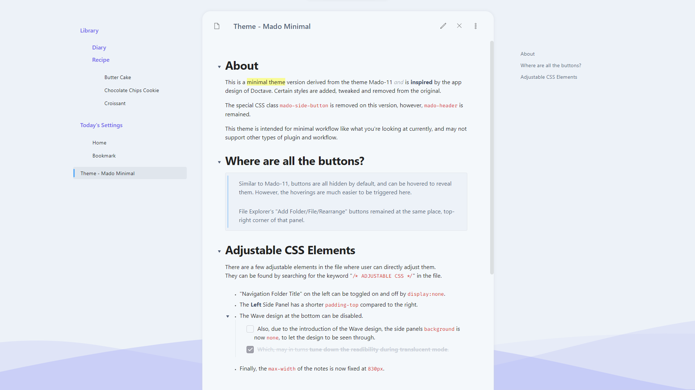
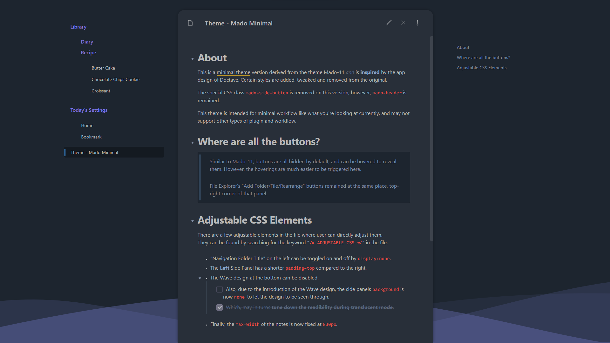

# Obsidian Theme - Mado Miniflow
This is a minimal theme version derived from the theme [Mado-11](https://github.com/hydescarf/Obsidian-Theme-Mado-11) and is inspired by the app design of [Doctave](https://www.doctave.com/). Certain styles are added, tweaked and removed from the original theme.
The wave design is made with https://www.shapedivider.app/

>  
> Notice: The style is currently being rewriting to support Obsidian v1.0 update!  
>  

The special CSS class `mado-side-button` is removed on this version, however, `mado-header` is remained.

This theme is intended for minimal workflow like what you're looking at currently, and may not support other types of plugin and workflow. However, feel free to pull a request for plugin supports, they may be in lower priorities but I'll take my time to support them

## Index

- [Roadmap](#roadmap)
- [Guideline](#guideline)
- [Changelog](#changelog)

## Roadmap
To stay true to the theme "minimal", I do not plan to adjust the main styles that will affect the current appearance.

However, to support the user experiences in the long run, I will have to refactor the code for future Style Settings and Plugins support.
This theme wasn't initially built with those in mind, so this might take a long time to complete.

The current workflow for now will be focusing more on bug fixing and minimal style adjusting, and some minor code adjustment in the background during my free time.
I will be focusing on Mado Miniflow first, and will then backport everything back to Mado 11.

For now, if you need any supports for your workflow (eg. method to show the status bar), open an issue and I'll guide you with temporary snippet fix!

## Guideline
Similar to Mado-11, buttons are all hidden by default, and can be hovered to reveal them at their default position.
- Recommended Font: Segoe UI, Noto Sans JP
- Resize Handle - hidden, hover to reveal.
- Status Bar, App Title, Vault Title - hidden.

###### Adjustable CSS Elements
There are a few adjustable elements in the file where user can directly adjust them.
They can be found by searching for the keyword "`/* ADJUSTABLE CSS */`" in the file.
- "Navigation Folder Title" or "Vault Title" on the left can be toggled on and off by `display:none`.
- Same goes to "Status Bar"
- The Wave design at the bottom can be disabled.
- Finally, the `max-width` of the notes is now fixed at `830px`.

## Changelog  
v0.2.3
- Adjusted indent spacing for plain text, code block and quote.

v0.2.2
- Fixed footnote-jumping issue.
   - The wave-design has now moved to `body:before` as it's the reason that causing the issue.

v0.2.1
- Fixed the remaining issue for mobile styling.
- Bullet point restyled to match the position with the text.
- Removed default background color when selected file is unfocused.
- Lines in Graph View are now more visible.
- Adjusted colours for Italic and Bold

v0.2.0
- Dock ribbon buttons are restyled for easier hovering.
- Workspace tabs, as well as sidebar vertical spacing are readjusted.
- "File Explorer" buttons are restyled and reverted back to their original position.
- Drag-Handler position are adjusted, you can now easily find their position by hovering just at the edges of the main/middle pane.
- Highlighted text in dark mode from the search result is now more readable.
- Background issue in Translucent Mode is now fixed.
- Mobile fixes:
   - Note title and buttons are adjusted.
   - Side margins beside the main note are removed.
   - Setting menu size is adjusted.
   - Ribbon buttons are no longer hidden by default.
   - Fixed weird bottom margin on the whole screen.
   - Applied padding in the main note.

v0.1.0
- Release!